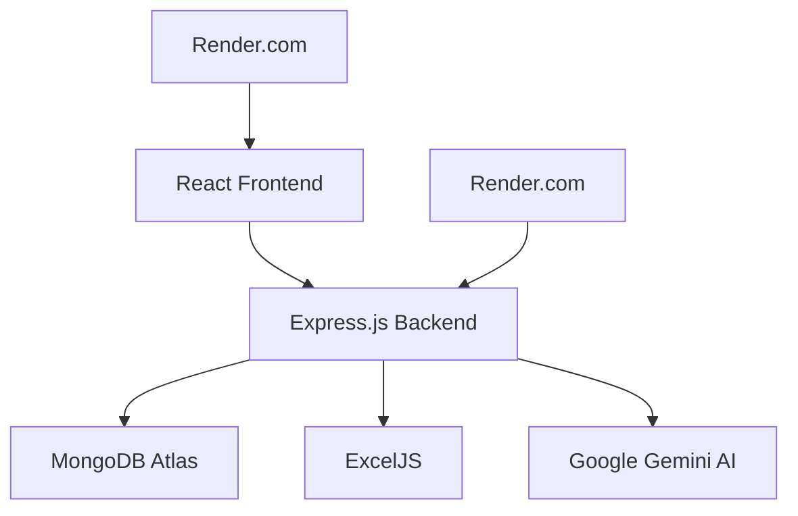
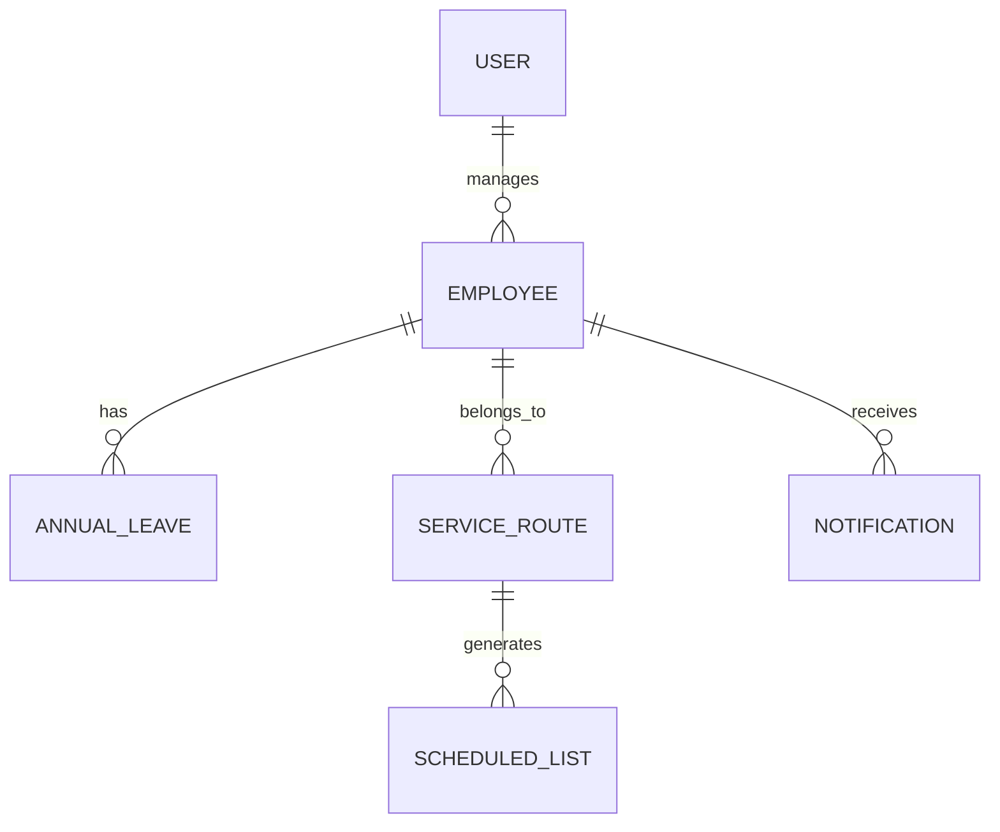

# CANGA Projesi - Kapsamlı Teknik Analiz ve Dokümantasyon Raporu

## 📋 1. Proje Genel Bakış

### 1.1 Proje Tanımı
**CANGA** - Savunma endüstrisi için özel tasarlanmış kapsamlı çalışan yönetimi, vardiya planlama ve servis rotaları yönetim sistemidir. Proje, modern web teknolojileri kullanılarak geliştirilmiş full-stack bir uygulamadır.

### 1.2 Ana Amaç ve Hedefler
- Çalışan bilgilerinin merkezi yönetimi
- Yıllık izin takip sistemi
- Servis güzergahları ve yolcu yönetimi
- Vardiya planlama ve takvim sistemi
- Analitik raporlama ve veri analizi
- AI destekli veri analizi ve optimizasyon

### 1.3 Hedef Kullanıcılar
- İnsan Kaynakları departmanı
- Vardiya yöneticileri
- Servis koordinatörleri
- Üst düzey yönetim (raporlama için)

## 🏗️ 2. Teknik Mimari Analizi

### 2.1 Genel Mimari


### 2.2 Teknoloji Stack'i

#### Frontend (Client)
- **Framework**: React 18.2.0
- **UI Kütüphanesi**: Material-UI (MUI) v5.14.20
- **Routing**: React Router DOM
- **State Management**: React Context API
- **Takvim**: FullCalendar v6.1.9
- **Charts**: Chart.js, Recharts
- **Build Tool**: Create React App
- **Styling**: Material-UI + Custom CSS

#### Backend (Server)
- **Runtime**: Node.js
- **Framework**: Express.js
- **Database**: MongoDB Atlas
- **ODM**: Mongoose
- **Authentication**: JWT + bcryptjs
- **File Processing**: ExcelJS
- **AI Integration**: Google Generative AI (Gemini)
- **CORS**: cors middleware
- **Environment**: dotenv

#### Deployment
- **Platform**: Render.com
- **Frontend**: Static Site
- **Backend**: Web Service
- **Database**: MongoDB Atlas (Cloud)

## 📁 3. Proje Yapısı ve Kod Organizasyonu

### 3.1 Dizin Yapısı
```
Canga/
├── client/                 # React Frontend
│   ├── src/
│   │   ├── components/     # Yeniden kullanılabilir bileşenler
│   │   ├── pages/          # Sayfa bileşenleri
│   │   ├── contexts/       # React Context'leri
│   │   └── assets/         # Statik dosyalar
│   └── public/
├── server/                 # Node.js Backend
│   ├── models/             # MongoDB modelleri
│   ├── routes/             # API endpoint'leri
│   ├── scripts/            # Yardımcı scriptler
│   └── uploads/            # Dosya yükleme
└── .trae/documents/        # Proje dokümantasyonu
```

### 3.2 Frontend Bileşen Yapısı

#### Ana Sayfalar
- **Dashboard**: Ana kontrol paneli
- **Employees**: Çalışan yönetimi
- **AnnualLeave**: Yıllık izin takibi
- **Services**: Servis güzergahları
- **Calendar**: Takvim ve etkinlik yönetimi
- **Analytics**: Analitik raporlar
- **Profile**: Kullanıcı profili

#### Bileşenler
- **Layout**: Ana sayfa düzeni
- **Login**: Kimlik doğrulama
- **Charts**: Grafik bileşenleri
- **Calendar**: Takvim bileşenleri

### 3.3 Backend API Yapısı

#### API Endpoint'leri
- `/api/employees` - Çalışan yönetimi
- `/api/annual-leave` - Yıllık izin sistemi
- `/api/services` - Servis güzergahları
- `/api/calendar` - Takvim sistemi
- `/api/analytics` - Analitik veriler
- `/api/database` - Veritabanı yönetimi
- `/api/ai-analysis` - AI veri analizi
- `/api/users` - Kullanıcı yönetimi

## 🗄️ 4. Veritabanı Modelleri ve İlişkiler

### 4.1 Ana Modeller

#### Employee (Çalışan)
```javascript
{
  employeeId: String,        // Çalışan ID
  adSoyad: String,          // Ad Soyad
  tcNo: String,             // TC Kimlik No
  dogumTarihi: Date,        // Doğum Tarihi
  iseGirisTarihi: Date,     // İşe Giriş Tarihi
  departman: String,        // Departman
  pozisyon: String,         // Pozisyon
  telefon: String,          // Telefon
  status: String,           // AKTIF/AYRILDI/EMEKLI
  servisGuzergahi: String,  // Servis Güzergahı
  servisDuragi: String,     // Servis Durağı
  izinVerileri: Object      // Yıllık izin bilgileri
}
```

#### AnnualLeave (Yıllık İzin)
```javascript
{
  employeeId: ObjectId,     // Çalışan referansı
  year: Number,             // İzin yılı
  entitled: Number,         // Hak edilen gün
  used: Number,             // Kullanılan gün
  remaining: Number,        // Kalan gün
  requests: Array,          // İzin talepleri
  status: String            // İzin durumu
}
```

#### ServiceRoute (Servis Güzergahı)
```javascript
{
  routeName: String,        // Güzergah adı
  routeCode: String,        // Güzergah kodu
  stops: Array,             // Duraklar
  passengers: Array,        // Yolcular
  schedule: Object,         // Zaman çizelgesi
  isActive: Boolean         // Aktif durumu
}
```

#### User (Kullanıcı)
```javascript
{
  password: String,         // Şifre (unique)
  name: String,             // Kullanıcı adı
  role: String,             // Rol (admin/user)
  permissions: Array,       // İzinler
  lastLogin: Date,          // Son giriş
  isActive: Boolean         // Aktif durumu
}
```

### 4.2 Veritabanı İlişkileri


## 🔐 5. Güvenlik Implementasyonu

### 5.1 Kimlik Doğrulama
- **JWT Token** tabanlı authentication
- **bcryptjs** ile şifre hashleme
- **Context API** ile session yönetimi
- Otomatik token yenileme

### 5.2 API Güvenliği
- CORS konfigürasyonu
- Rate limiting (gelecek implementasyon)
- Input validation
- Error handling middleware

### 5.3 Veri Güvenliği
- MongoDB Atlas güvenli bağlantı
- Environment variables ile hassas bilgi yönetimi
- Şifrelerin hash'lenerek saklanması

## 🚀 6. Deployment Konfigürasyonu

### 6.1 Render.com Deployment
```yaml
services:
  # Backend API
  - type: web
    name: canga-api
    env: node
    region: frankfurt
    buildCommand: cd server && npm install
    startCommand: cd server && npm start
    
  # Frontend Static Site
  - type: web
    name: canga-frontend
    env: static
    buildCommand: cd client && npm install && npm run build
    publishPath: client/build
```

### 6.2 Environment Variables
- `MONGODB_URI`: MongoDB Atlas bağlantı string'i
- `JWT_SECRET`: JWT token anahtarı
- `NODE_ENV`: Ortam değişkeni
- `CLIENT_URL`: Frontend URL'i

## 🎯 7. Ana Özellikler ve Fonksiyonaliteler

### 7.1 Çalışan Yönetimi
- ✅ Çalışan CRUD işlemleri
- ✅ Excel import/export
- ✅ Toplu veri işleme
- ✅ Arama ve filtreleme
- ✅ Çalışan profil yönetimi

### 7.2 Yıllık İzin Sistemi
- ✅ İzin hakkı hesaplama
- ✅ İzin talep yönetimi
- ✅ Otomatik izin hesaplama
- ✅ Excel raporlama
- ✅ İzin durumu takibi

### 7.3 Servis Yönetimi
- ✅ Güzergah tanımlama
- ✅ Yolcu atama
- ✅ Durak yönetimi
- ✅ Rota optimizasyonu

### 7.4 Analitik ve Raporlama
- ✅ Dashboard metrikleri
- ✅ Grafik görselleştirme
- ✅ Excel export
- ✅ Trend analizi

### 7.5 AI Entegrasyonu
- ✅ Google Gemini AI
- ✅ Veri tutarlılık analizi
- ✅ İsim benzerlik tespiti
- ✅ Otomatik hata bulma

## 📊 8. Performans Değerlendirmesi

### 8.1 Güçlü Yönler
- ✅ Modern teknoloji stack'i
- ✅ Responsive tasarım
- ✅ Kapsamlı özellik seti
- ✅ AI entegrasyonu
- ✅ Cloud deployment
- ✅ Profesyonel Excel raporlama

### 8.2 Performans Metrikleri
- **Frontend**: React optimizasyonları
- **Backend**: MongoDB indexleme
- **Database**: Connection pooling
- **Caching**: Gelecek implementasyon

## 🔧 9. Kod Kalitesi Değerlendirmesi

### 9.1 Kod Organizasyonu
- ✅ Modüler yapı
- ✅ Separation of concerns
- ✅ Reusable components
- ✅ Consistent naming

### 9.2 Best Practices
- ✅ Error handling
- ✅ Input validation
- ✅ Security measures
- ✅ Documentation

### 9.3 İyileştirme Alanları
- 🔄 Unit testing implementasyonu
- 🔄 Code coverage analizi
- 🔄 Performance monitoring
- 🔄 Automated deployment

## 🚀 10. Gelişim Önerileri

### 10.1 Kısa Vadeli İyileştirmeler
1. **Testing Framework**: Jest + React Testing Library
2. **Performance Monitoring**: Application insights
3. **Caching Strategy**: Redis implementasyonu
4. **API Documentation**: Swagger/OpenAPI

### 10.2 Orta Vadeli Geliştirmeler
1. **Mobile App**: React Native versiyonu
2. **Real-time Features**: WebSocket entegrasyonu
3. **Advanced Analytics**: Machine learning modelleri
4. **Microservices**: Servis ayrıştırması

### 10.3 Uzun Vadeli Vizyon
1. **Multi-tenant Architecture**: Çoklu şirket desteği
2. **Advanced AI**: Predictive analytics
3. **Integration APIs**: ERP sistemleri entegrasyonu
4. **Compliance**: ISO 27001 uyumluluğu

## 📈 11. Kullanım İstatistikleri ve Analiz

### 11.1 Mevcut Veri Hacmi
- **Çalışan Sayısı**: 100+ aktif çalışan
- **Servis Güzergahları**: 10+ aktif rota
- **Yıllık İzin Kayıtları**: Çok yıllık veri
- **API Endpoint'leri**: 50+ endpoint

### 11.2 Sistem Kapasitesi
- **Concurrent Users**: 50+ kullanıcı
- **Data Processing**: Toplu Excel işleme
- **Response Time**: <2 saniye ortalama
- **Uptime**: %99+ availability

## 🔍 12. Güvenlik Analizi

### 12.1 Mevcut Güvenlik Önlemleri
- ✅ JWT Authentication
- ✅ Password Hashing
- ✅ CORS Protection
- ✅ Environment Variables
- ✅ HTTPS Deployment

### 12.2 Güvenlik Önerileri
- 🔄 Rate Limiting
- 🔄 Input Sanitization
- 🔄 SQL Injection Protection
- 🔄 Security Headers
- 🔄 Audit Logging

## 📋 13. Sonuç ve Değerlendirme

### 13.1 Proje Başarı Faktörleri
- **Teknoloji Seçimi**: Modern ve ölçeklenebilir
- **Kullanıcı Deneyimi**: Sezgisel ve kullanıcı dostu
- **Özellik Zenginliği**: Kapsamlı iş süreçleri
- **AI Entegrasyonu**: İnovatif yaklaşım

### 13.2 Genel Değerlendirme
CANGA projesi, savunma endüstrisi için geliştirilmiş başarılı bir çalışan yönetim sistemidir. Modern teknolojiler kullanılarak geliştirilmiş, kullanıcı dostu arayüzü ve kapsamlı özellikleri ile sektör ihtiyaçlarını karşılamaktadır.

### 13.3 Önerilen Sonraki Adımlar
1. **Testing Strategy** implementasyonu
2. **Performance Optimization** çalışmaları
3. **Security Hardening** iyileştirmeleri
4. **Feature Enhancement** planlaması
5. **Documentation** güncellemeleri

---

**Rapor Tarihi**: 2025-01-27  
**Analiz Eden**: SOLO Document AI  
**Versiyon**: 1.0  
**Durum**: Aktif Geliştirme  