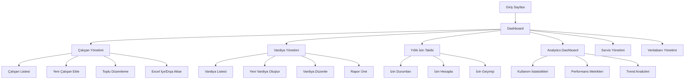

# ÇANGA SAVUNMA ENDÜSTRİSİ - İNSAN KAYNAKLARI YÖNETİM SİSTEMİ
## Ürün Gereksinim Dokümanı (PRD)

---

## 1. Ürün Genel Bakışı

Çanga Savunma Endüstrisi İnsan Kaynakları Yönetim Sistemi, savunma sanayi sektöründe faaliyet gösteren kurumların çalışan yönetimi, vardiya planlaması, yıllık izin takibi ve operasyonel raporlama ihtiyaçlarını karşılamak üzere geliştirilmiş kapsamlı bir web tabanlı yönetim platformudur.

Sistem, 500+ çalışanı bulunan kurumsal yapıların karmaşık organizasyon şemalarını, çoklu lokasyon yönetimini ve detaylı raporlama gereksinimlerini destekleyerek operasyonel verimliliği artırmayı hedefler.

Proje, modern web teknolojileri kullanılarak geliştirilmiş olup, güvenlik, ölçeklenebilirlik ve kullanıcı deneyimi açısından endüstri standartlarını karşılamaktadır.

## 2. Temel Özellikler

### 2.1 Kullanıcı Rolleri

| Rol | Kayıt Yöntemi | Temel Yetkiler |
|-----|---------------|----------------|
| Sistem Yöneticisi | ADMIN-001 kimlik kodu ile | Tüm sistem özelliklerine erişim, veritabanı yönetimi, kullanıcı yönetimi |
| İK Uzmanı | Yönetici tarafından oluşturulan hesap | Çalışan CRUD işlemleri, izin yönetimi, raporlama |
| Vardiya Sorumlusu | Departman bazlı yetkilendirme | Vardiya oluşturma/düzenleme, çalışan atama |
| Görüntüleyici | Salt okunur erişim | Dashboard görüntüleme, rapor indirme |

### 2.2 Özellik Modülleri

Sistemimiz aşağıdaki ana sayfa ve modüllerden oluşmaktadır:

1. **Dashboard**: Gerçek zamanlı istatistikler, hızlı erişim menüleri, sistem durumu göstergeleri
2. **Çalışan Yönetimi**: CRUD işlemleri, toplu düzenleme, Excel entegrasyonu, gelişmiş filtreleme
3. **Vardiya Yönetimi**: Vardiya oluşturma, çalışan atama, imza listesi üretimi, durum takibi
4. **Yıllık İzin Takibi**: Otomatik hesaplama, izin geçmişi, talep yönetimi, raporlama
5. **Analytics Dashboard**: Sistem kullanım istatistikleri, performans metrikleri, trend analizleri
6. **Servis Yönetimi**: Güzergah planlaması, yolcu listesi, servis programı üretimi
7. **Veritabanı Yönetimi**: MongoDB koleksiyon yönetimi, veri analizi, sistem bakımı

### 2.3 Sayfa Detayları

| Sayfa Adı | Modül Adı | Özellik Açıklaması |
|-----------|-----------|--------------------|
| Dashboard | Ana İstatistikler | Toplam çalışan sayısı, aktif vardiya sayısı, departman dağılımı grafikleri görüntüle |
| Dashboard | Hızlı Aksiyonlar | Yeni vardiya oluştur, çalışan ekle, rapor indir butonları sağla |
| Dashboard | Son Aktiviteler | En son oluşturulan vardiyalar, sistem bildirimleri, bekleyen onaylar listele |
| Çalışan Yönetimi | Çalışan Listesi | Sayfalama, filtreleme, arama ile çalışan kayıtlarını görüntüle |
| Çalışan Yönetimi | CRUD İşlemleri | Çalışan ekle, düzenle, sil, toplu güncelleme yap |
| Çalışan Yönetimi | Excel Entegrasyonu | Çalışan verilerini Excel'den içe aktar, Excel'e dışa aktar |
| Çalışan Yönetimi | Gelişmiş Filtreleme | Departman, lokasyon, durum, tarih aralığı bazlı filtreleme uygula |
| Vardiya Yönetimi | Vardiya Oluşturma | Lokasyon, tarih, çalışan grubu seçimi ile vardiya planı oluştur |
| Vardiya Yönetimi | Çalışan Atama | Departman bazlı çalışan seçimi ve vardiya saatlerine atama yap |
| Vardiya Yönetimi | Durum Yönetimi | Vardiya durumunu TASLAK, ONAYLANDI, İPTAL olarak güncelle |
| Vardiya Yönetimi | Rapor Üretimi | İmza listesi, servis programı, Excel formatında rapor oluştur |
| Yıllık İzin | İzin Hesaplama | Yaş, kıdem, önceki izin kullanımı bazlı otomatik hesaplama yap |
| Yıllık İzin | İzin Geçmişi | Çalışan bazlı izin kullanım geçmişi ve detaylarını görüntüle |
| Yıllık İzin | Toplu İşlemler | Tüm çalışanlar için izin durumlarını hesapla ve güncelle |
| Analytics | Kullanım İstatistikleri | Sistem kullanım oranları, en aktif kullanıcılar, performans metrikleri göster |
| Analytics | Trend Analizleri | Aylık, haftalık kullanım trendleri, departman bazlı analizler sağla |
| Servis Yönetimi | Güzergah Planlaması | Servis güzergahları ve durak atamaları yönet |
| Servis Yönetimi | Yolcu Listesi | Güzergah bazlı yolcu listesi oluştur ve yönet |

## 3. Temel Süreçler

### Ana Kullanıcı İş Akışları

**İK Uzmanı İş Akışı:**
1. Sisteme giriş yap → Dashboard'u görüntüle
2. Çalışan Yönetimi'ne git → Yeni çalışan ekle veya mevcut kayıtları düzenle
3. Excel dosyasından toplu çalışan verisi içe aktar
4. Yıllık İzin modülünde izin hesaplamalarını kontrol et
5. Gerekli raporları Excel formatında dışa aktar

**Vardiya Sorumlusu İş Akışı:**
1. Sisteme giriş yap → Vardiya Yönetimi'ne git
2. Yeni vardiya oluştur → Lokasyon ve tarih seç
3. Departman bazlı çalışan listesinden seçim yap
4. Vardiya saatlerine çalışanları ata
5. İmza listesi ve servis programı oluştur
6. Vardiya durumunu ONAYLANDI olarak güncelle

**Sistem Yöneticisi İş Akışı:**
1. Sisteme giriş yap → Analytics Dashboard'u kontrol et
2. Veritabanı Yönetimi'nde sistem durumunu izle
3. Kullanıcı yetkilendirmelerini yönet
4. Sistem performans metriklerini analiz et

### Sayfa Navigasyon Akış Şeması

## 4. Kullanıcı Arayüzü Tasarımı

### 4.1 Tasarım Stili

**Ana Renkler:**
- Birincil Renk: #1976d2 (Çanga Mavi)
- İkincil Renk: #dc004e (Çanga Kırmızı)
- Başarı Rengi: #2e7d32 (Yeşil)
- Uyarı Rengi: #ed6c02 (Turuncu)
- Hata Rengi: #d32f2f (Kırmızı)

**Buton Stilleri:**
- Yuvarlak köşeli (border-radius: 8px)
- Gradient arka planlar
- Hover efektleri ile interaktif deneyim
- Material Design prensipleri

**Tipografi:**
- Ana Font: Roboto, sans-serif
- Başlık Boyutları: h1(2.5rem), h2(2rem), h3(1.5rem)
- Gövde Metni: 14px-16px arası
- Monospace: Courier New (kod blokları için)

**Layout Stili:**
- Kart tabanlı tasarım (Card-based layout)
- Üst navigasyon menüsü
- Sol sidebar ile ana menü
- Grid sistem ile responsive düzen
- Material-UI component library kullanımı

**İkon ve Emoji Stilleri:**
- Material Icons kütüphanesi
- Departman ve özellik bazlı emoji kullanımı (📊, 👥, 📅, 🚌)
- Tutarlı icon boyutları (16px, 24px, 32px)

### 4.2 Sayfa Tasarım Genel Bakışı

| Sayfa Adı | Modül Adı | UI Elementleri |
|-----------|-----------|----------------|
| Dashboard | Ana İstatistikler | Gradient renkli stat kartları, Chart.js grafikleri, #1976d2 ve #dc004e renk paleti, Roboto font |
| Dashboard | Hızlı Aksiyonlar | Floating Action Button'lar, Material Icons, hover animasyonları, 8px border-radius |
| Çalışan Yönetimi | Çalışan Listesi | DataGrid tablosu, sayfalama kontrolleri, arama çubuğu, filtreleme dropdown'ları |
| Çalışan Yönetimi | Çalışan Kartları | Avatar bileşenleri, Chip etiketleri, Card layout, responsive grid sistem |
| Vardiya Yönetimi | Vardiya Oluşturma | Step-by-step wizard, date picker, multi-select dropdown, progress indicator |
| Vardiya Yönetimi | Çalışan Atama | Drag-drop interface, grup bazlı listeleme, real-time güncelleme |
| Yıllık İzin | İzin Hesaplama | Progress bar'lar, hesaplama sonuç kartları, renk kodlu durum göstergeleri |
| Analytics | Grafik Gösterimi | Chart.js entegrasyonu, interaktif grafikler, export butonları, drill-down özelliği |

### 4.3 Responsive Tasarım

**Desktop-First Yaklaşım:**
- Ana hedef: 1920x1080 çözünürlük
- Minimum desteklenen: 1366x768
- Sidebar navigation ile geniş ekran optimizasyonu

**Mobile Adaptasyon:**
- Breakpoint: 768px altı için mobile layout
- Hamburger menü ile navigation
- Touch-friendly button boyutları (minimum 44px)
- Swipe gesture desteği
- Responsive tablo görünümleri

**Tablet Optimizasyonu:**
- 768px - 1024px arası için hybrid layout
- Collapsible sidebar
- Touch ve mouse input desteği
- Landscape/portrait mode adaptasyonu

---

## Teknik Mimari ve Implementasyon Detayları

### Backend Teknoloji Stack'i
- **Framework:** Node.js v18+ ile Express.js
- **Veritabanı:** MongoDB Atlas (Cloud) + Mongoose ODM
- **Güvenlik:** bcryptjs, CORS, session management
- **Dosya İşleme:** ExcelJS, multer
- **Deployment:** Render.com (Production), localhost:5001 (Development)

### Frontend Teknoloji Stack'i
- **Framework:** React 18.2.0 + React Router DOM v6
- **UI Library:** Material-UI (MUI) v5.x
- **State Management:** React Context API
- **HTTP Client:** Axios
- **Grafik:** Chart.js + react-chartjs-2
- **Deployment:** Vercel (Production), localhost:3000 (Development)

### Veritabanı Şeması
**Ana Koleksiyonlar:**
- employees (Çalışan kayıtları)
- shifts (Vardiya planları)
- annualLeave (Yıllık izin kayıtları)
- users (Sistem kullanıcıları)
- notifications (Sistem bildirimleri)
- analytics (Kullanım istatistikleri)

### API Endpoint Yapısı
- **Base URL:** https://canga-api.onrender.com/api
- **Authentication:** Session-based
- **Rate Limiting:** 100 request/minute
- **Response Format:** JSON
- **Error Handling:** Standardized error responses

### Güvenlik Önlemleri
- HTTPS zorunluluğu
- CORS policy konfigürasyonu
- Input validation ve sanitization
- SQL injection koruması
- Session timeout (1 saat)
- Password hashing (bcryptjs)

### Performans Optimizasyonları
- MongoDB indexing
- React.memo kullanımı
- Lazy loading
- Image optimization
- Caching strategies
- Bundle size optimization

Bu dokümantasyon, Çanga Savunma Endüstrisi İnsan Kaynakları Yönetim Sistemi'nin kapsamlı gereksinimlerini ve teknik özelliklerini detaylandırmaktadır.