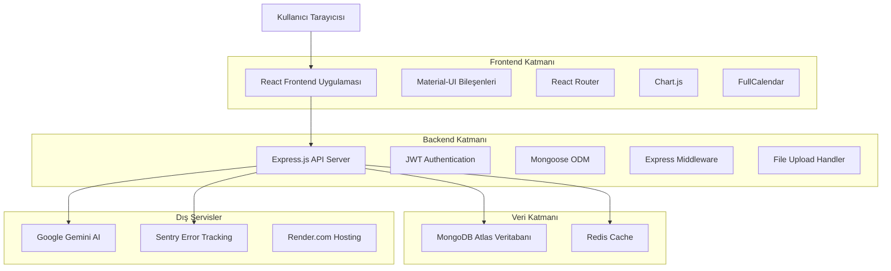
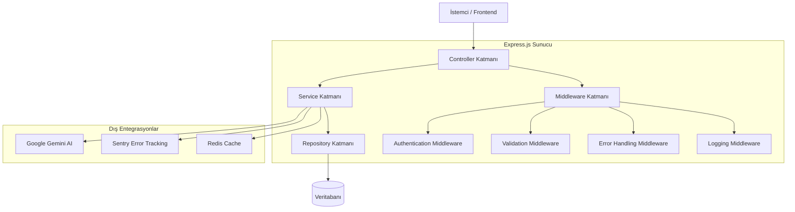
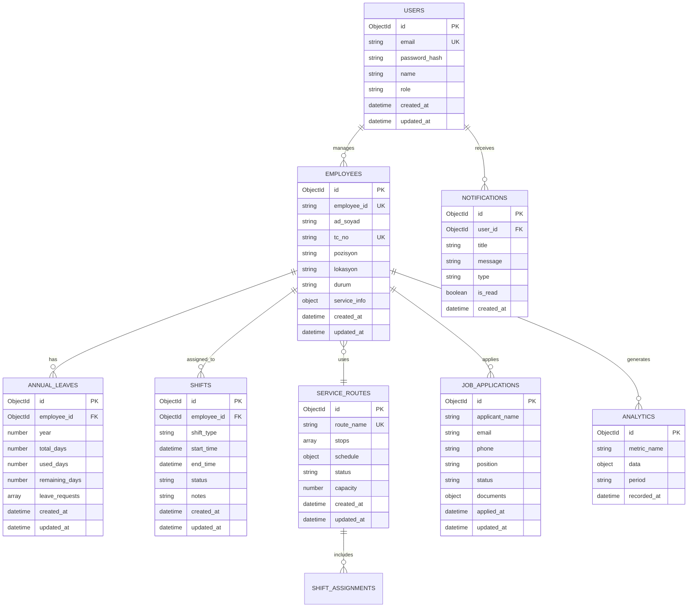

# CANGA TEKNİK MİMARİ DOKÜMANTASYONU

## 1. Mimari Tasarım



## 2. Teknoloji Açıklaması

### Frontend
- **React@18.2.0** - Modern UI kütüphanesi, hooks ve concurrent features
- **Material-UI@5.14.20** - Google Material Design bileşen kütüphanesi
- **React Router@6.20.1** - Client-side routing ve lazy loading
- **Chart.js@4.5.0** - İnteraktif grafik ve analitik görselleştirme
- **FullCalendar@6.1.9** - Kapsamlı takvim ve vardiya planlama
- **Axios@1.6.2** - HTTP client ve API iletişimi
- **Vite** - Modern build tool ve development server

### Backend
- **Node.js@24.7.0** - JavaScript runtime environment
- **Express.js@4.18.2** - Web application framework
- **Mongoose@8.16.1** - MongoDB object modeling
- **JWT@9.0.2** - Token-based authentication
- **bcryptjs@2.4.3** - Password hashing
- **ExcelJS@4.4.0** - Excel dosya işleme
- **Google Generative AI** - AI entegrasyonu

### Veritabanı ve Cache
- **MongoDB Atlas** - Cloud-native NoSQL veritabanı
- **Redis** - In-memory cache ve session store

### DevOps ve Hosting
- **Render.com** - Cloud hosting platform
- **Sentry** - Error tracking ve monitoring (devre dışı)
- **Git** - Version control system

## 3. Route Tanımlamaları

### Frontend Routes

| Route | Amaç | Bileşen |
|-------|------|----------|
| `/` | Ana sayfa, dashboard görünümü | Dashboard.js |
| `/login` | Kullanıcı giriş sayfası | Login.js |
| `/employees` | Çalışan listesi ve yönetimi | Employees.js |
| `/employees/new` | Yeni çalışan ekleme formu | AddEmployee.js |
| `/employees/:id` | Çalışan detay ve düzenleme | EmployeeDetail.js |
| `/shifts` | Vardiya planlama ve yönetimi | Shifts.js |
| `/annual-leaves` | Yıllık izin takip sistemi | AnnualLeaves.js |
| `/service-routes` | Servis güzergahı yönetimi | ServiceRoutes.js |
| `/analytics` | Analitik dashboard ve raporlar | Analytics.js |
| `/job-applications` | İş başvuruları listesi | JobApplicationsList.js |
| `/database-management` | Veritabanı yönetim araçları | DatabaseManagement.js |
| `/profile` | Kullanıcı profil ayarları | Profile.js |

### Backend API Routes

| Route | Method | Amaç |
|-------|--------|------|
| `/api/auth/login` | POST | Kullanıcı girişi |
| `/api/auth/register` | POST | Yeni kullanıcı kaydı |
| `/api/employees` | GET | Tüm çalışanları listele |
| `/api/employees` | POST | Yeni çalışan ekle |
| `/api/employees/:id` | GET | Çalışan detayını getir |
| `/api/employees/:id` | PUT | Çalışan bilgilerini güncelle |
| `/api/employees/:id` | DELETE | Çalışanı sil |
| `/api/shifts` | GET | Vardiya planlarını listele |
| `/api/shifts` | POST | Yeni vardiya planı oluştur |
| `/api/annual-leaves` | GET | Yıllık izin kayıtlarını getir |
| `/api/annual-leaves` | POST | Yeni izin kaydı oluştur |
| `/api/service-routes` | GET | Servis güzergahlarını listele |
| `/api/service-routes` | POST | Yeni güzergah oluştur |
| `/api/analytics/dashboard` | GET | Dashboard istatistikleri |
| `/api/analytics/reports` | GET | Detaylı analitik raporlar |
| `/api/upload/excel` | POST | Excel dosya yükleme |
| `/api/export/excel` | GET | Excel rapor indirme |

## 4. API Tanımlamaları

### 4.1 Temel API Yapısı

#### Kimlik Doğrulama
```
POST /api/auth/login
```

**İstek:**
| Parametre | Tip | Zorunlu | Açıklama |
|-----------|-----|---------|----------|
| email | string | true | Kullanıcı e-posta adresi |
| password | string | true | Kullanıcı şifresi |

**Yanıt:**
| Parametre | Tip | Açıklama |
|-----------|-----|----------|
| success | boolean | İşlem başarı durumu |
| token | string | JWT access token |
| user | object | Kullanıcı bilgileri |

**Örnek İstek:**
```json
{
  "email": "admin@canga.com",
  "password": "securePassword123"
}
```

**Örnek Yanıt:**
```json
{
  "success": true,
  "token": "eyJhbGciOiJIUzI1NiIsInR5cCI6IkpXVCJ9...",
  "user": {
    "id": "64f8a1b2c3d4e5f6a7b8c9d0",
    "email": "admin@canga.com",
    "role": "admin",
    "name": "Sistem Yöneticisi"
  }
}
```

#### Çalışan Yönetimi
```
GET /api/employees
```

**Query Parametreleri:**
| Parametre | Tip | Zorunlu | Açıklama |
|-----------|-----|---------|----------|
| page | number | false | Sayfa numarası (varsayılan: 1) |
| limit | number | false | Sayfa başına kayıt (varsayılan: 50) |
| search | string | false | Arama terimi |
| status | string | false | Durum filtresi (AKTIF, PASIF, İZİNLİ, AYRILDI) |
| location | string | false | Lokasyon filtresi |

**Yanıt:**
| Parametre | Tip | Açıklama |
|-----------|-----|----------|
| employees | array | Çalışan listesi |
| totalCount | number | Toplam çalışan sayısı |
| currentPage | number | Mevcut sayfa |
| totalPages | number | Toplam sayfa sayısı |

```
POST /api/employees
```

**İstek:**
| Parametre | Tip | Zorunlu | Açıklama |
|-----------|-----|---------|----------|
| adSoyad | string | true | Çalışan adı soyadı |
| tcNo | string | false | TC kimlik numarası |
| pozisyon | string | true | Çalışan pozisyonu |
| lokasyon | string | true | Çalışma lokasyonu |
| durum | string | true | Çalışan durumu |
| serviceInfo | object | false | Servis bilgileri |

#### Vardiya Yönetimi
```
GET /api/shifts
```

**Query Parametreleri:**
| Parametre | Tip | Zorunlu | Açıklama |
|-----------|-----|---------|----------|
| startDate | string | false | Başlangıç tarihi (YYYY-MM-DD) |
| endDate | string | false | Bitiş tarihi (YYYY-MM-DD) |
| employeeId | string | false | Çalışan ID filtresi |
| shiftType | string | false | Vardiya tipi filtresi |

#### Analitik API
```
GET /api/analytics/dashboard
```

**Yanıt:**
| Parametre | Tip | Açıklama |
|-----------|-----|----------|
| totalEmployees | number | Toplam çalışan sayısı |
| activeEmployees | number | Aktif çalışan sayısı |
| onLeaveEmployees | number | İzinli çalışan sayısı |
| departmentStats | array | Departman istatistikleri |
| locationStats | array | Lokasyon istatistikleri |
| recentActivities | array | Son aktiviteler |

## 5. Sunucu Mimarisi Diyagramı



### Katman Açıklamaları

#### Controller Katmanı
- HTTP isteklerini karşılar
- Request/Response işlemlerini yönetir
- Validation sonuçlarını kontrol eder
- Service katmanını çağırır

#### Service Katmanı
- İş mantığını içerir
- Veri işleme operasyonlarını gerçekleştirir
- Dış servislere entegrasyon sağlar
- Repository katmanını kullanır

#### Repository Katmanı
- Veritabanı işlemlerini yönetir
- Mongoose modellerini kullanır
- CRUD operasyonlarını gerçekleştirir
- Query optimizasyonu sağlar

#### Middleware Katmanı
- Authentication kontrolü
- Input validation
- Error handling
- Request logging
- Rate limiting

## 6. Veri Modeli

### 6.1 Veri Modeli Tanımı



### 6.2 Veri Tanımlama Dili (DDL)

#### Kullanıcılar Tablosu (users)
```javascript
// Kullanıcı şeması oluştur
const userSchema = new mongoose.Schema({
  email: {
    type: String,
    required: true,
    unique: true,
    lowercase: true,
    trim: true
  },
  password: {
    type: String,
    required: true,
    minlength: 6
  },
  name: {
    type: String,
    required: true,
    trim: true
  },
  role: {
    type: String,
    enum: ['admin', 'manager', 'user'],
    default: 'user'
  },
  isActive: {
    type: Boolean,
    default: true
  }
}, {
  timestamps: true
});

// İndeksler
userSchema.index({ email: 1 });
userSchema.index({ role: 1, isActive: 1 });

// Başlangıç verisi
const defaultUsers = [
  {
    email: 'admin@canga.com',
    password: 'hashedPassword123',
    name: 'Sistem Yöneticisi',
    role: 'admin'
  },
  {
    email: 'manager@canga.com',
    password: 'hashedPassword456',
    name: 'Vardiya Müdürü',
    role: 'manager'
  }
];
```

#### Çalışanlar Tablosu (employees)
```javascript
// Çalışan şeması oluştur
const employeeSchema = new mongoose.Schema({
  employeeId: {
    type: String,
    unique: true,
    sparse: true
  },
  adSoyad: {
    type: String,
    required: true,
    trim: true
  },
  tcNo: {
    type: String,
    unique: true,
    sparse: true,
    validate: {
      validator: function(v) {
        return !v || /^[0-9]{11}$/.test(v);
      },
      message: 'TC No 11 haneli olmalıdır'
    }
  },
  pozisyon: {
    type: String,
    required: true
  },
  lokasyon: {
    type: String,
    required: true,
    enum: ['MERKEZ', 'İŞL', 'OSB', 'İŞIL']
  },
  durum: {
    type: String,
    required: true,
    enum: ['AKTIF', 'PASIF', 'İZİNLİ', 'AYRILDI'],
    default: 'AKTIF'
  },
  serviceInfo: {
    usesService: {
      type: Boolean,
      default: false
    },
    routeName: String,
    routeId: {
      type: mongoose.Schema.Types.ObjectId,
      ref: 'ServiceRoute'
    }
  },
  contactInfo: {
    phone: String,
    email: String,
    address: String
  },
  departmentInfo: {
    department: String,
    team: String,
    supervisor: String
  }
}, {
  timestamps: true
});

// İndeksler
employeeSchema.index({ employeeId: 1 });
employeeSchema.index({ adSoyad: 'text' });
employeeSchema.index({ durum: 1, lokasyon: 1 });
employeeSchema.index({ pozisyon: 1 });
employeeSchema.index({ 'serviceInfo.routeId': 1 });

// Pre-save middleware - otomatik employeeId oluşturma
employeeSchema.pre('save', async function(next) {
  if (!this.employeeId) {
    const count = await this.constructor.countDocuments();
    this.employeeId = `EMP${String(count + 1).padStart(4, '0')}`;
  }
  next();
});
```

#### Servis Güzergahları Tablosu (serviceroutes)
```javascript
// Servis güzergahı şeması oluştur
const serviceRouteSchema = new mongoose.Schema({
  routeName: {
    type: String,
    required: true,
    unique: true,
    trim: true
  },
  stops: [{
    name: {
      type: String,
      required: true
    },
    coordinates: {
      lat: Number,
      lng: Number
    },
    estimatedTime: String,
    order: Number
  }],
  schedule: {
    departureTime: String,
    arrivalTime: String,
    frequency: String,
    workingDays: [String]
  },
  capacity: {
    type: Number,
    default: 50
  },
  status: {
    type: String,
    enum: ['AKTIF', 'PASIF', 'BAKIM'],
    default: 'AKTIF'
  },
  driverInfo: {
    name: String,
    phone: String,
    licenseNumber: String
  },
  vehicleInfo: {
    plateNumber: String,
    model: String,
    year: Number
  }
}, {
  timestamps: true
});

// İndeksler
serviceRouteSchema.index({ routeName: 1 });
serviceRouteSchema.index({ status: 1 });
serviceRouteSchema.index({ 'stops.name': 'text' });

// Başlangıç verisi
const defaultRoutes = [
  {
    routeName: 'MERKEZ-İŞL Hattı',
    stops: [
      { name: 'Merkez Kampüs', order: 1, estimatedTime: '07:00' },
      { name: 'Metro İstasyonu', order: 2, estimatedTime: '07:15' },
      { name: 'İŞL Fabrika', order: 3, estimatedTime: '07:45' }
    ],
    schedule: {
      departureTime: '07:00',
      arrivalTime: '07:45',
      frequency: 'Günlük',
      workingDays: ['Pazartesi', 'Salı', 'Çarşamba', 'Perşembe', 'Cuma']
    },
    capacity: 45,
    status: 'AKTIF'
  }
];
```

#### Yıllık İzinler Tablosu (annualleaves)
```javascript
// Yıllık izin şeması oluştur
const annualLeaveSchema = new mongoose.Schema({
  employeeId: {
    type: mongoose.Schema.Types.ObjectId,
    ref: 'Employee',
    required: true
  },
  year: {
    type: Number,
    required: true,
    min: 2020,
    max: 2030
  },
  entitlement: {
    totalDays: {
      type: Number,
      required: true,
      default: 14
    },
    usedDays: {
      type: Number,
      default: 0
    },
    remainingDays: {
      type: Number,
      default: function() {
        return this.entitlement.totalDays - this.entitlement.usedDays;
      }
    }
  },
  leaveRequests: [{
    startDate: {
      type: Date,
      required: true
    },
    endDate: {
      type: Date,
      required: true
    },
    days: {
      type: Number,
      required: true
    },
    reason: String,
    status: {
      type: String,
      enum: ['BEKLEMEDE', 'ONAYLANDI', 'REDDEDİLDİ'],
      default: 'BEKLEMEDE'
    },
    approvedBy: {
      type: mongoose.Schema.Types.ObjectId,
      ref: 'User'
    },
    approvedAt: Date,
    notes: String,
    requestedAt: {
      type: Date,
      default: Date.now
    }
  }]
}, {
  timestamps: true
});

// İndeksler
annualLeaveSchema.index({ employeeId: 1, year: 1 }, { unique: true });
annualLeaveSchema.index({ year: 1 });
annualLeaveSchema.index({ 'leaveRequests.status': 1 });
annualLeaveSchema.index({ 'leaveRequests.startDate': 1, 'leaveRequests.endDate': 1 });
```

#### Vardiyalar Tablosu (shifts)
```javascript
// Vardiya şeması oluştur
const shiftSchema = new mongoose.Schema({
  employeeId: {
    type: mongoose.Schema.Types.ObjectId,
    ref: 'Employee',
    required: true
  },
  shiftType: {
    type: String,
    required: true,
    enum: ['SABAH', 'ÖĞLE', 'AKŞAM', 'GECE', 'MESAI']
  },
  date: {
    type: Date,
    required: true
  },
  startTime: {
    type: String,
    required: true
  },
  endTime: {
    type: String,
    required: true
  },
  location: {
    type: String,
    required: true,
    enum: ['MERKEZ', 'İŞL', 'OSB', 'İŞIL']
  },
  status: {
    type: String,
    enum: ['PLANLI', 'AKTIF', 'TAMAMLANDI', 'İPTAL'],
    default: 'PLANLI'
  },
  notes: String,
  overtime: {
    hours: {
      type: Number,
      default: 0
    },
    approved: {
      type: Boolean,
      default: false
    }
  }
}, {
  timestamps: true
});

// İndeksler
shiftSchema.index({ employeeId: 1, date: 1 });
shiftSchema.index({ date: 1, shiftType: 1 });
shiftSchema.index({ location: 1, date: 1 });
shiftSchema.index({ status: 1 });
```

---

**Dokümantasyon Versiyonu:** 1.0  
**Son Güncelleme:** 2024  
**Hazırlayan:** SOLO Document AI  
**Sonraki İnceleme:** Q2 2024