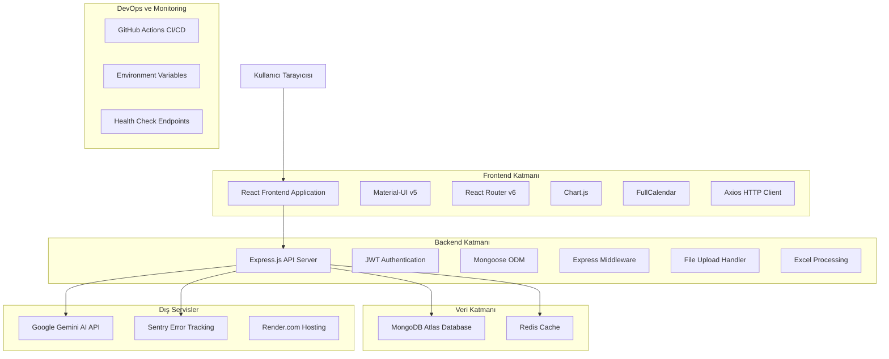
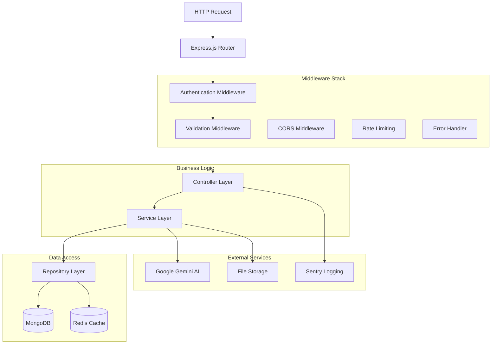
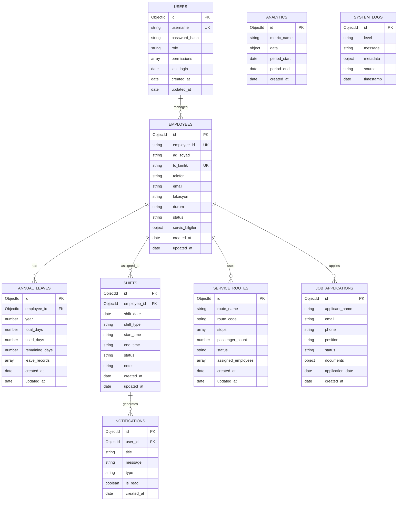

# CANGA SİSTEMİ - TEKNİK MİMARİ DOKÜMANTASYONU

## 1. Mimari Tasarım



## 2. Teknoloji Açıklaması

### Frontend Teknolojileri
- **React**: 18.2.0 - Modern UI framework
- **Material-UI**: 5.14.20 - Component library
- **React Router**: 6.20.1 - Client-side routing
- **Chart.js**: 4.5.0 - Data visualization
- **FullCalendar**: 6.1.10 - Calendar component
- **Axios**: 1.6.2 - HTTP client
- **Vite**: Build tool ve development server

### Backend Teknolojileri
- **Node.js**: 24.7.0 LTS - Runtime environment
- **Express.js**: 4.18.2 - Web framework
- **Mongoose**: 8.16.1 - MongoDB ODM
- **JWT**: 9.0.2 - Authentication
- **bcryptjs**: 2.4.3 - Password hashing
- **Redis**: Caching ve session storage

### Veritabanı
- **MongoDB Atlas**: Cloud NoSQL database
- **Redis**: In-memory cache

### DevOps ve Deployment
- **Render.com**: Cloud hosting platform
- **GitHub Actions**: CI/CD pipeline
- **Sentry**: Error tracking ve monitoring

## 3. Route Tanımlamaları

### Frontend Routes

| Route | Amaç | Component |
|-------|------|----------|
| `/` | Ana sayfa yönlendirmesi | Redirect to /dashboard |
| `/login` | Kullanıcı girişi | Login |
| `/dashboard` | Ana kontrol paneli | Dashboard |
| `/employees` | Çalışan yönetimi | Employees |
| `/former-employees` | İşten ayrılan çalışanlar | FormerEmployees |
| `/annual-leaves` | Yıllık izin sistemi | AnnualLeaves |
| `/shifts` | Vardiya planlama | Shifts |
| `/service-routes` | Servis güzergahları | ServiceRoutes |
| `/analytics` | Analitik dashboard | Analytics |
| `/job-applications` | İş başvuruları | JobApplications |
| `/database-management` | Veri yönetimi | DatabaseManagement |
| `/notifications` | Bildirimler | Notifications |

### Backend API Routes

| Route | Method | Amaç |
|-------|--------|------|
| `/api/health` | GET | Sistem sağlık kontrolü |
| `/api/auth/login` | POST | Kullanıcı girişi |
| `/api/auth/logout` | POST | Kullanıcı çıkışı |
| `/api/employees` | GET, POST, PUT, DELETE | Çalışan CRUD işlemleri |
| `/api/annual-leaves` | GET, POST, PUT, DELETE | Yıllık izin yönetimi |
| `/api/shifts` | GET, POST, PUT, DELETE | Vardiya yönetimi |
| `/api/service-routes` | GET, POST, PUT, DELETE | Servis güzergahları |
| `/api/analytics` | GET | Analitik veriler |
| `/api/upload` | POST | Dosya yükleme |
| `/api/export` | GET | Excel export |

## 4. API Tanımlamaları

### 4.1 Kimlik Doğrulama API'leri

#### Kullanıcı Girişi
```
POST /api/auth/login
```

**Request:**
| Parametre | Tip | Zorunlu | Açıklama |
|-----------|-----|---------|----------|
| username | string | true | Kullanıcı adı |
| password | string | true | Şifre |

**Response:**
| Parametre | Tip | Açıklama |
|-----------|-----|----------|
| success | boolean | İşlem durumu |
| token | string | JWT token |
| user | object | Kullanıcı bilgileri |

**Örnek Request:**
```json
{
  "username": "admin",
  "password": "password123"
}
```

**Örnek Response:**
```json
{
  "success": true,
  "token": "eyJhbGciOiJIUzI1NiIsInR5cCI6IkpXVCJ9...",
  "user": {
    "id": "507f1f77bcf86cd799439011",
    "username": "admin",
    "role": "admin"
  }
}
```

### 4.2 Çalışan Yönetimi API'leri

#### Çalışan Listesi
```
GET /api/employees
```

**Query Parameters:**
| Parametre | Tip | Zorunlu | Açıklama |
|-----------|-----|---------|----------|
| page | number | false | Sayfa numarası (default: 1) |
| limit | number | false | Sayfa başına kayıt (default: 50) |
| status | string | false | Çalışan durumu (active, inactive) |
| lokasyon | string | false | Lokasyon filtresi |

**Response:**
```json
{
  "success": true,
  "employees": [
    {
      "_id": "507f1f77bcf86cd799439011",
      "employeeId": "EMP001",
      "adSoyad": "Ahmet Yılmaz",
      "tcKimlik": "12345678901",
      "status": "active",
      "lokasyon": "Ankara",
      "durum": "Çalışıyor",
      "createdAt": "2024-01-01T00:00:00.000Z"
    }
  ],
  "pagination": {
    "currentPage": 1,
    "totalPages": 3,
    "totalEmployees": 102,
    "hasNext": true,
    "hasPrev": false
  }
}
```

#### Çalışan Oluşturma
```
POST /api/employees
```

**Request:**
```json
{
  "adSoyad": "Mehmet Demir",
  "tcKimlik": "98765432109",
  "lokasyon": "İstanbul",
  "durum": "Çalışıyor",
  "telefon": "05551234567",
  "email": "mehmet.demir@example.com"
}
```

### 4.3 Vardiya Yönetimi API'leri

#### Vardiya Listesi
```
GET /api/shifts
```

**Query Parameters:**
| Parametre | Tip | Zorunlu | Açıklama |
|-----------|-----|---------|----------|
| startDate | string | false | Başlangıç tarihi (YYYY-MM-DD) |
| endDate | string | false | Bitiş tarihi (YYYY-MM-DD) |
| employeeId | string | false | Çalışan ID filtresi |

**Response:**
```json
{
  "success": true,
  "shifts": [
    {
      "_id": "507f1f77bcf86cd799439012",
      "employeeId": "507f1f77bcf86cd799439011",
      "shiftDate": "2024-01-15",
      "shiftType": "morning",
      "startTime": "08:00",
      "endTime": "16:00",
      "status": "scheduled"
    }
  ]
}
```

### 4.4 Analitik API'leri

#### Dashboard İstatistikleri
```
GET /api/analytics/dashboard
```

**Response:**
```json
{
  "success": true,
  "stats": {
    "totalEmployees": 102,
    "activeEmployees": 98,
    "totalShifts": 1250,
    "pendingLeaves": 5,
    "serviceRoutes": 8,
    "monthlyStats": {
      "newEmployees": 3,
      "completedShifts": 890,
      "leaveRequests": 12
    }
  }
}
```

## 5. Sunucu Mimarisi Diyagramı



## 6. Veri Modeli

### 6.1 Veri Modeli Tanımı



### 6.2 Veri Tanım Dili (DDL)

#### Kullanıcılar Koleksiyonu
```javascript
// users collection
const userSchema = new mongoose.Schema({
  username: {
    type: String,
    required: true,
    unique: true,
    trim: true,
    minlength: 3,
    maxlength: 50
  },
  passwordHash: {
    type: String,
    required: true
  },
  role: {
    type: String,
    enum: ['admin', 'manager', 'user'],
    default: 'user'
  },
  permissions: [{
    type: String,
    enum: ['read', 'write', 'delete', 'admin']
  }],
  lastLogin: {
    type: Date
  },
  loginHistory: [{
    timestamp: Date,
    ipAddress: String,
    userAgent: String
  }]
}, {
  timestamps: true
});

// Indexes
userSchema.index({ username: 1 });
userSchema.index({ role: 1 });
userSchema.index({ lastLogin: -1 });
```

#### Çalışanlar Koleksiyonu
```javascript
// employees collection
const employeeSchema = new mongoose.Schema({
  employeeId: {
    type: String,
    unique: true,
    sparse: true
  },
  adSoyad: {
    type: String,
    required: true,
    trim: true
  },
  ad: String,
  soyad: String,
  tcKimlik: {
    type: String,
    unique: true,
    sparse: true,
    validate: {
      validator: function(v) {
        return /^[0-9]{11}$/.test(v);
      },
      message: 'TC Kimlik 11 haneli olmalıdır'
    }
  },
  telefon: {
    type: String,
    validate: {
      validator: function(v) {
        return /^[0-9]{10,11}$/.test(v);
      }
    }
  },
  email: {
    type: String,
    lowercase: true,
    validate: {
      validator: function(v) {
        return /^[^\s@]+@[^\s@]+\.[^\s@]+$/.test(v);
      }
    }
  },
  lokasyon: {
    type: String,
    enum: ['Ankara', 'İstanbul', 'İzmir', 'Bursa', 'Antalya']
  },
  durum: {
    type: String,
    enum: ['Çalışıyor', 'İzinli', 'İşten Ayrıldı', 'Emekli'],
    default: 'Çalışıyor'
  },
  status: {
    type: String,
    enum: ['active', 'inactive', 'suspended'],
    default: 'active'
  },
  servisBilgileri: {
    kullaniyor: {
      type: Boolean,
      default: false
    },
    guzergah: String,
    bindigi_durak: String,
    indigi_durak: String
  },
  departman: String,
  pozisyon: String,
  iseBaslamaTarihi: Date,
  maas: {
    type: Number,
    min: 0
  }
}, {
  timestamps: true
});

// Indexes
employeeSchema.index({ employeeId: 1 });
employeeSchema.index({ tcKimlik: 1 });
employeeSchema.index({ status: 1, lokasyon: 1 });
employeeSchema.index({ durum: 1 });
employeeSchema.index({ adSoyad: 'text', employeeId: 'text' });
employeeSchema.index({ 'servisBilgileri.kullaniyor': 1 });
```

#### Yıllık İzinler Koleksiyonu
```javascript
// annual_leaves collection
const annualLeaveSchema = new mongoose.Schema({
  employeeId: {
    type: mongoose.Schema.Types.ObjectId,
    ref: 'Employee',
    required: true
  },
  year: {
    type: Number,
    required: true,
    min: 2020,
    max: 2030
  },
  totalDays: {
    type: Number,
    required: true,
    min: 0,
    max: 45
  },
  usedDays: {
    type: Number,
    default: 0,
    min: 0
  },
  remainingDays: {
    type: Number,
    default: function() {
      return this.totalDays - this.usedDays;
    }
  },
  leaveRecords: [{
    startDate: {
      type: Date,
      required: true
    },
    endDate: {
      type: Date,
      required: true
    },
    days: {
      type: Number,
      required: true,
      min: 1
    },
    reason: String,
    status: {
      type: String,
      enum: ['pending', 'approved', 'rejected'],
      default: 'pending'
    },
    approvedBy: {
      type: mongoose.Schema.Types.ObjectId,
      ref: 'User'
    },
    createdAt: {
      type: Date,
      default: Date.now
    }
  }]
}, {
  timestamps: true
});

// Compound indexes
annualLeaveSchema.index({ employeeId: 1, year: 1 }, { unique: true });
annualLeaveSchema.index({ year: 1, remainingDays: -1 });
annualLeaveSchema.index({ 'leaveRecords.status': 1 });
```

#### Vardiyalar Koleksiyonu
```javascript
// shifts collection
const shiftSchema = new mongoose.Schema({
  employeeId: {
    type: mongoose.Schema.Types.ObjectId,
    ref: 'Employee',
    required: true
  },
  shiftDate: {
    type: Date,
    required: true
  },
  shiftType: {
    type: String,
    enum: ['morning', 'afternoon', 'night', 'overtime'],
    required: true
  },
  startTime: {
    type: String,
    required: true,
    validate: {
      validator: function(v) {
        return /^([0-1]?[0-9]|2[0-3]):[0-5][0-9]$/.test(v);
      }
    }
  },
  endTime: {
    type: String,
    required: true,
    validate: {
      validator: function(v) {
        return /^([0-1]?[0-9]|2[0-3]):[0-5][0-9]$/.test(v);
      }
    }
  },
  status: {
    type: String,
    enum: ['scheduled', 'in_progress', 'completed', 'cancelled'],
    default: 'scheduled'
  },
  notes: String,
  location: String,
  department: String
}, {
  timestamps: true
});

// Indexes
shiftSchema.index({ employeeId: 1, shiftDate: 1 });
shiftSchema.index({ shiftDate: 1, shiftType: 1 });
shiftSchema.index({ status: 1 });
shiftSchema.index({ shiftDate: -1 });
```

#### Servis Güzergahları Koleksiyonu
```javascript
// service_routes collection
const serviceRouteSchema = new mongoose.Schema({
  routeName: {
    type: String,
    required: true,
    trim: true
  },
  routeCode: {
    type: String,
    unique: true,
    required: true
  },
  stops: [{
    name: {
      type: String,
      required: true
    },
    order: {
      type: Number,
      required: true
    },
    coordinates: {
      lat: Number,
      lng: Number
    },
    estimatedTime: String
  }],
  passengerCount: {
    type: Number,
    default: 0,
    min: 0
  },
  capacity: {
    type: Number,
    default: 50,
    min: 1
  },
  status: {
    type: String,
    enum: ['active', 'inactive', 'maintenance'],
    default: 'active'
  },
  assignedEmployees: [{
    type: mongoose.Schema.Types.ObjectId,
    ref: 'Employee'
  }],
  schedule: {
    weekdays: [{
      day: {
        type: String,
        enum: ['monday', 'tuesday', 'wednesday', 'thursday', 'friday', 'saturday', 'sunday']
      },
      departureTime: String,
      returnTime: String
    }]
  }
}, {
  timestamps: true
});

// Indexes
serviceRouteSchema.index({ routeCode: 1 });
serviceRouteSchema.index({ status: 1 });
serviceRouteSchema.index({ routeName: 'text' });
```

#### Başlangıç Verileri
```javascript
// Initial data insertion
const initializeDatabase = async () => {
  try {
    // Create admin user
    const adminUser = new User({
      username: 'admin',
      passwordHash: await bcrypt.hash('admin123', 10),
      role: 'admin',
      permissions: ['read', 'write', 'delete', 'admin']
    });
    await adminUser.save();
    
    // Create sample service routes
    const sampleRoutes = [
      {
        routeName: 'Ankara - Kızılay Hattı',
        routeCode: 'ANK-KZL-001',
        stops: [
          { name: 'Kızılay Meydanı', order: 1 },
          { name: 'Sıhhiye', order: 2 },
          { name: 'Maltepe', order: 3 }
        ],
        passengerCount: 45,
        capacity: 50,
        status: 'active'
      }
    ];
    
    await ServiceRoute.insertMany(sampleRoutes);
    
    console.log('Database initialized successfully');
  } catch (error) {
    console.error('Database initialization error:', error);
  }
};
```

## 7. Güvenlik ve Performans Konfigürasyonu

### 7.1 Güvenlik Middleware
```javascript
// Security middleware setup
const helmet = require('helmet');
const rateLimit = require('express-rate-limit');
const mongoSanitize = require('express-mongo-sanitize');

// Rate limiting
const limiter = rateLimit({
  windowMs: 15 * 60 * 1000, // 15 minutes
  max: 100, // limit each IP to 100 requests per windowMs
  message: 'Too many requests from this IP'
});

// Security headers
app.use(helmet({
  contentSecurityPolicy: {
    directives: {
      defaultSrc: ["'self'"],
      styleSrc: ["'self'", "'unsafe-inline'", "https://fonts.googleapis.com"],
      fontSrc: ["'self'", "https://fonts.gstatic.com"],
      imgSrc: ["'self'", "data:", "https:"],
      scriptSrc: ["'self'"]
    }
  }
}));

// NoSQL injection prevention
app.use(mongoSanitize());

// Apply rate limiting
app.use('/api/', limiter);
```

### 7.2 Performans Optimizasyonu
```javascript
// Redis caching middleware
const redis = require('redis');
const client = redis.createClient(process.env.REDIS_URL);

const cacheMiddleware = (duration = 300) => {
  return async (req, res, next) => {
    const key = `cache:${req.method}:${req.originalUrl}`;
    
    try {
      const cached = await client.get(key);
      if (cached) {
        return res.json(JSON.parse(cached));
      }
      
      res.sendResponse = res.json;
      res.json = (body) => {
        client.setex(key, duration, JSON.stringify(body));
        res.sendResponse(body);
      };
      
      next();
    } catch (error) {
      next();
    }
  };
};

// Database connection optimization
mongoose.connect(process.env.MONGODB_URI, {
  maxPoolSize: 10,
  serverSelectionTimeoutMS: 5000,
  socketTimeoutMS: 45000,
  bufferCommands: false,
  bufferMaxEntries: 0
});
```

Bu teknik mimari dokümantasyonu, CANGA sisteminin mevcut durumunu ve önerilen iyileştirmeleri kapsamlı bir şekilde açıklamaktadır. Sistem, modern web teknolojileri kullanılarak geliştirilmiş ve ölçeklenebilir bir yapıya sahiptir.