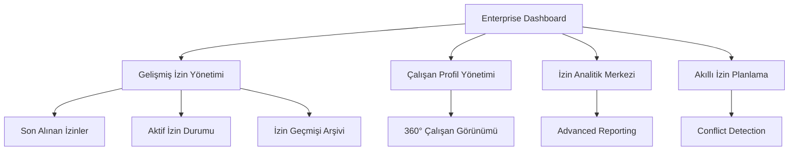

# Gelişmiş Yıllık İzin Takip Sistemi - Enterprise Seviye Ürün Gereksinim Belgesi

## 1. Ürün Genel Bakış

Canga şirketi için enterprise seviyesinde tasarlanmış, kullanıcı dostu ve profesyonel yıllık izin takip sistemi. Sistem, çalışanların izin haklarını otomatik hesaplar, son alınan izinleri detaylı şekilde görüntüler ve kapsamlı izin yönetimi sağlar.

Sistem, modern UI/UX prensipleriyle tasarlanmış olup, tüm kullanıcıların izin işlemlerini kolayca gerçekleştirebileceği enterprise seviyesinde bir platform sunar. Gelişmiş analitik ve raporlama özellikleriyle HR süreçlerini optimize eder.

## 2. Temel Özellikler

### 2.1 Kullanıcı Rolleri

| Rol | Kayıt Yöntemi | Temel Yetkiler |
|-----|---------------|----------------|
| Varsayılan Kullanıcı | Sistem otomatik erişim | Tüm izin işlemlerini görüntüleme, oluşturma, düzenleme ve yönetme |

### 2.2 Özellik Modülleri

Gelişmiş izin takip sistemimiz aşağıdaki ana sayfalardan oluşmaktadır:

1. **Enterprise Dashboard**: Gelişmiş istatistikler, KPI kartları, trend analizleri ve executive özet
2. **Gelişmiş İzin Yönetimi**: Son alınan izinler, aktif izin talepleri, izin geçmişi ve detaylı yönetim paneli
3. **Çalışan Profil Yönetimi**: Kapsamlı çalışan bilgileri, izin hakları ve kişiselleştirilmiş dashboard
4. **İzin Analitik Merkezi**: Gelişmiş raporlama, trend analizleri ve predictive analytics
5. **Akıllı İzin Planlama**: Otomatik izin önerileri, çakışma kontrolü ve optimal planlama
6. **Bildirim ve Onay Sistemi**: Real-time bildirimler, otomatik onay süreçleri ve escalation

### 2.3 Sayfa Detayları

| Sayfa Adı | Modül Adı | Özellik Açıklaması |
|-----------|-----------|--------------------||
| Enterprise Dashboard | Executive KPI Kartları | Toplam çalışan, kullanılan izin, ortalama kullanım, trend göstergeleri ile interactive kartlar |
| Enterprise Dashboard | Gelişmiş İstatistik Paneli | Departman bazlı analiz, yaş grubu dağılımı, hizmet yılı analizi, kullanım oranları |
| Enterprise Dashboard | Quick Action Center | Hızlı izin talebi, toplu işlemler, acil onaylar için one-click butonlar |
| Gelişmiş İzin Yönetimi | Son Alınan İzinler Paneli | Chronological timeline, izin detayları, süre bilgileri, notlar ve belgeler |
| Gelişmiş İzin Yönetimi | Aktif İzin Durumu | Ongoing izinler, yaklaşan izinler, bekleyen onaylar real-time görüntüleme |
| Gelişmiş İzin Yönetimi | İzin Geçmişi Arşivi | Multi-year görünüm, filtreleme, arama, export ve detaylı analiz |
| Gelişmiş İzin Yönetimi | Akıllı İzin Talep Sistemi | Auto-complete tarih seçimi, çakışma kontrolü, optimal tarih önerileri |
| Çalışan Profil Yönetimi | 360° Çalışan Görünümü | Kişisel bilgiler, izin hakları, performans metrikleri, departman bilgileri |
| Çalışan Profil Yönetimi | Kişiselleştirilmiş Dashboard | User-specific widgets, favorite shortcuts, personalized notifications |
| Çalışan Profil Yönetimi | İzin Hakkı Hesaplayıcısı | Real-time hesaplama, scenario planning, future entitlement projections |
| İzin Analitik Merkezi | Advanced Reporting Engine | Custom report builder, scheduled reports, automated insights |
| İzin Analitik Merkezi | Trend Analysis Dashboard | Historical trends, seasonal patterns, predictive analytics |
| İzin Analitik Merkezi | Departmental Analytics | Cross-departmental comparison, utilization heatmaps, efficiency metrics |
| Akıllı İzin Planlama | Conflict Detection System | Automatic overlap detection, alternative date suggestions, team coverage analysis |
| Akıllı İzin Planlama | Optimal Planning Assistant | AI-powered recommendations, workload balancing, seasonal optimization |
| Bildirim ve Onay Sistemi | Real-time Notification Center | Push notifications, email alerts, mobile notifications, escalation rules |
| Bildirim ve Onay Sistemi | Automated Approval Workflow | Multi-level approvals, delegation rules, auto-approval conditions |

## 3. Temel Süreç

### Gelişmiş Kullanıcı Akışı:
1. Enterprise Dashboard'dan comprehensive overview görüntüler
2. Son alınan izinleri timeline formatında inceler
3. Akıllı planlama sistemi ile optimal izin tarihleri belirler
4. Advanced analytics ile departman performansını analiz eder
5. Real-time notifications ile approval süreçlerini takip eder
6. Custom reports ile executive summaries oluşturur

## 4. Kullanıcı Arayüzü Tasarımı

### 4.1 Tasarım Stili

- **Ana Renkler**: Modern gradient palette - Primary Blue (#1976d2 to #1565c0), Accent Red (#dc004e to #c62828)
- **İkincil Renkler**: Sophisticated grays (#fafafa, #f5f5f5, #eeeeee) with subtle shadows and depth
- **Buton Stili**: Elevated design with subtle shadows, 12px border-radius, micro-interactions and hover effects
- **Font**: Inter font family for modern readability, weight hierarchy (300-700), optimized line-heights
- **Layout Stili**: Card-based design with glassmorphism effects, floating action buttons, responsive grid with breakpoints
- **İkon Stili**: Custom icon set with consistent 24px sizing, outlined and filled variants, animated transitions

### 4.2 Sayfa Tasarım Genel Bakışı

| Sayfa Adı | Modül Adı | UI Elementleri |
|-----------|-----------|----------------|
| Enterprise Dashboard | KPI Kartları | Gradient backgrounds with glassmorphism, animated counters, trend indicators, interactive hover states |
| Enterprise Dashboard | İstatistik Paneli | Data visualization with Chart.js, interactive legends, drill-down capabilities, responsive charts |
| Gelişmiş İzin Yönetimi | Son İzinler Timeline | Vertical timeline with cards, color-coded status, expandable details, smooth animations |
| Gelişmiş İzin Yönetimi | İzin Yönetim Tablosu | Advanced DataGrid with virtual scrolling, inline editing, bulk actions, custom cell renderers |
| Çalışan Profil | 360° Görünüm | Tabbed interface with smooth transitions, progress rings, achievement badges, activity feed |
| Analitik Merkezi | Reporting Dashboard | Interactive charts, filter panels, export options, scheduled report builder |
| Akıllı Planlama | Planlama Takvimi | Full-featured calendar with drag-drop, conflict highlighting, multi-view options |

### 4.3 Responsive Tasarım

Sistem mobile-first yaklaşımla tasarlanmış olup, progressive enhancement ile desktop experience optimize edilir. Touch-friendly interfaces, swipe gestures, ve adaptive layouts tüm cihazlarda optimal kullanıcı deneyimi sağlar. Breakpoints: 320px (mobile), 768px (tablet), 1024px (desktop), 1440px (large desktop).