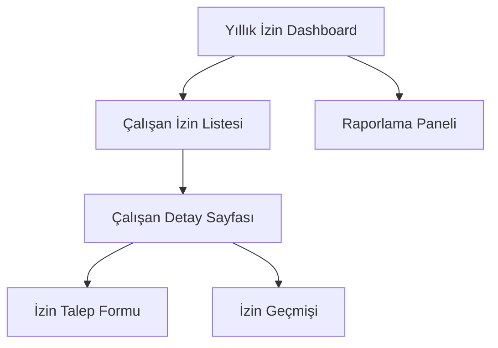

# Canga Yıllık İzin Takip Sistemi - Ürün Gereksinim Belgesi

## 1. Ürün Genel Bakış

Canga şirketi için çalışanların yıllık izin haklarını otomatik hesaplayan, takip eden ve yöneten kapsamlı bir web tabanlı sistem. Sistem, çalışanların yaş ve hizmet yılına göre izin haklarını otomatik hesaplar ve yıllık izin kullanımlarını takip eder.

Sistem, mevcut Excel tabanlı manuel süreçleri dijitalleştirerek insan hatalarını minimize eder ve HR departmanının iş yükünü azaltır.

## 2. Temel Özellikler

### 2.1 Kullanıcı Rolleri

| Rol | Kayıt Yöntemi | Temel Yetkiler |
|-----|---------------|----------------|
| HR Yöneticisi | Sistem yöneticisi tarafından eklenir | Tüm çalışanların izin bilgilerini görüntüleme, düzenleme, onaylama |
| Çalışan | Mevcut Employee veritabanından otomatik | Kendi izin bilgilerini görüntüleme, izin talebi oluşturma |
| Sistem Yöneticisi | Manuel ekleme | Tüm sistem ayarları, kullanıcı yönetimi, veri yönetimi |

### 2.2 Özellik Modülleri

Sistemimiz aşağıdaki ana sayfalardan oluşmaktadır:

1. **Yıllık İzin Dashboard**: Genel istatistikler, özet bilgiler ve hızlı erişim menüleri
2. **Çalışan İzin Listesi**: Tüm çalışanların izin durumlarının tablo halinde görüntülenmesi
3. **Çalışan Detay Sayfası**: Seçilen çalışanın detaylı izin geçmişi ve hesaplamaları
4. **İzin Hesaplama Motoru**: Yaş ve hizmet yılına göre otomatik izin hesaplama sistemi
5. **İzin Talep Yönetimi**: İzin taleplerinin oluşturulması ve onaylanması
6. **Raporlama Paneli**: Excel export, yazdırma ve analiz raporları

### 2.3 Sayfa Detayları

| Sayfa Adı | Modül Adı | Özellik Açıklaması |
|-----------|-----------|--------------------|
| Yıllık İzin Dashboard | İstatistik Kartları | Toplam çalışan sayısı, kullanılan izin günleri, ortalama izin kullanımı gösterimi |
| Yıllık İzin Dashboard | Hızlı Erişim Menüsü | Çalışan arama, yeni izin talebi, raporlar için hızlı erişim butonları |
| Çalışan İzin Listesi | Çalışan Tablosu | Ad-soyad, yaş, hizmet yılı, hak edilen izin, kullanılan izin, kalan izin bilgileri |
| Çalışan İzin Listesi | Filtreleme Sistemi | Departman, yaş grubu, hizmet yılı, izin durumuna göre filtreleme |
| Çalışan İzin Listesi | Arama Fonksiyonu | Çalışan adı veya sicil numarasına göre anlık arama |
| Çalışan Detay Sayfası | Kişisel Bilgiler | Çalışanın temel bilgileri, yaş, hizmet yılı, departman bilgileri |
| Çalışan Detay Sayfası | İzin Hesaplama Paneli | Yaş ve hizmet yılına göre otomatik hesaplanan izin hakları |
| Çalışan Detay Sayfası | İzin Geçmişi | Yıllara göre kullanılan izin günleri ve detayları |
| Çalışan Detay Sayfası | İzin Talep Formu | Yeni izin talebi oluşturma, tarih seçimi, gün hesaplama |
| İzin Hesaplama Motoru | Yaş Hesaplama | Doğum tarihinden otomatik yaş hesaplama |
| İzin Hesaplama Motoru | Hizmet Yılı Hesaplama | İşe giriş tarihinden hizmet yılı hesaplama |
| İzin Hesaplama Motoru | İzin Hakkı Hesaplama | 50 yaş altı: ilk 5 yıl 14 gün, sonrası 20 gün; 50 yaş üstü: 20 gün |
| İzin Talep Yönetimi | Talep Oluşturma | Başlangıç-bitiş tarihi seçimi, gün sayısı otomatik hesaplama |
| İzin Talep Yönetimi | Talep Onaylama | HR yöneticisi onay/red işlemleri, onay notları |
| Raporlama Paneli | Excel Export | Çalışan izin listelerinin Excel formatında dışa aktarımı |
| Raporlama Paneli | Yazdırma | Sayfa ve rapor yazdırma fonksiyonları |

## 3. Temel Süreç

### HR Yöneticisi Akışı:
1. Dashboard'dan genel durumu görüntüler
2. Çalışan listesinden istenen çalışanı bulur
3. Çalışan detayına girerek izin durumunu inceler
4. Gerekirse izin taleplerini onaylar/reddeder
5. Raporları Excel formatında dışa aktarır

### Çalışan Akışı:
1. Kendi izin durumunu görüntüler
2. Yeni izin talebi oluşturur
3. Talep durumunu takip eder

## 4. Kullanıcı Arayüzü Tasarımı

### 4.1 Tasarım Stili

- **Ana Renkler**: Mavi (#1976d2) ve Kırmızı (#dc004e) - Canga kurumsal renkleri
- **İkincil Renkler**: Gri tonları (#f5f5f5, #ffffff) temiz ve profesyonel görünüm için
- **Buton Stili**: Yuvarlatılmış köşeli (8px border-radius), Material Design prensiplerine uygun
- **Font**: Roboto font ailesi, başlıklar için 500-600 weight, içerik için 400 weight
- **Layout Stili**: Card tabanlı tasarım, sol navigasyon menüsü, responsive grid sistem
- **İkon Stili**: Material Design ikonları, tutarlı boyutlarda (24px standart)

### 4.2 Sayfa Tasarım Genel Bakışı

| Sayfa Adı | Modül Adı | UI Elementleri |
|-----------|-----------|----------------|
| Yıllık İzin Dashboard | İstatistik Kartları | Mavi gradient arka plan, beyaz metin, büyük sayılar (h4), ikonlar sağ üstte |
| Yıllık İzin Dashboard | Hızlı Erişim | Primary mavi butonlar, ikonlu tasarım, 3 sütunlu grid layout |
| Çalışan İzin Listesi | Veri Tablosu | Material-UI DataGrid, zebra striping, hover efektleri, sıralama ok ikonları |
| Çalışan İzin Listesi | Filtreleme | Dropdown menüler, arama input'u, temizle butonu, responsive tasarım |
| Çalışan Detay Sayfası | Bilgi Kartları | Beyaz arka plan, gölgeli card'lar, renkli progress bar'lar |
| Çalışan Detay Sayfası | İzin Formu | Modal dialog, tarih seçiciler, otomatik hesaplama, yeşil gönder butonu |
| Raporlama Paneli | Export Butonları | İkonlu butonlar, loading spinner'lar, başarı mesajları |

### 4.3 Responsive Tasarım

Sistem desktop-first yaklaşımla tasarlanmış olup, tablet ve mobil cihazlarda da kullanılabilir. Tablo görünümleri mobilde kart görünümüne dönüşür ve touch etkileşimleri optimize edilir.
